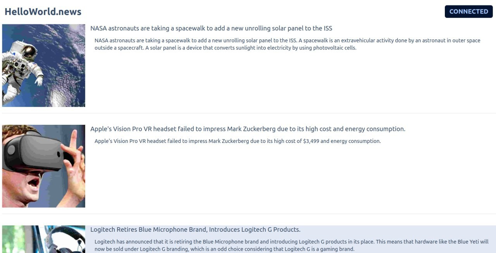
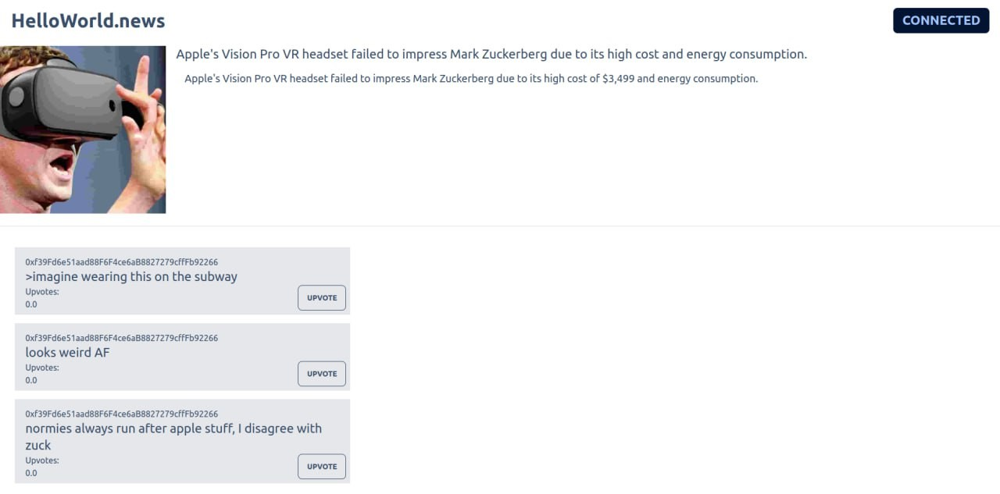

# The hello world User Experience

The hello world user experience is simple and intuitive for any user, with a familiar imageboard layout and Web3 integration. 

If you’ve posted on 4chan and used MetaMask, interacting with the hello world app is second nature.
#   

#   

Users can view the day’s headlines, each a HEADLINE NFT and AI-generated thumbnail, on the app’s main page. 

To view the COMMENTs minted on a headline, simply click the headline and view the thread. 

#   

#   

There are initially two ways users can interact with a thread, by minting a COMMENT and by upvoting a COMMENT. Both interactions require the user to burn NEWS tokens.

 
 
 

    <a class="pagination-nav__link prev" href="stable-diffusion.md">
        
Previous

        
< Stable Diffusion

    </a>
    <a class="pagination-nav__link next" href="minting-a-comment.md">
        
Next

        
Mint COMMENT >

    </a>

